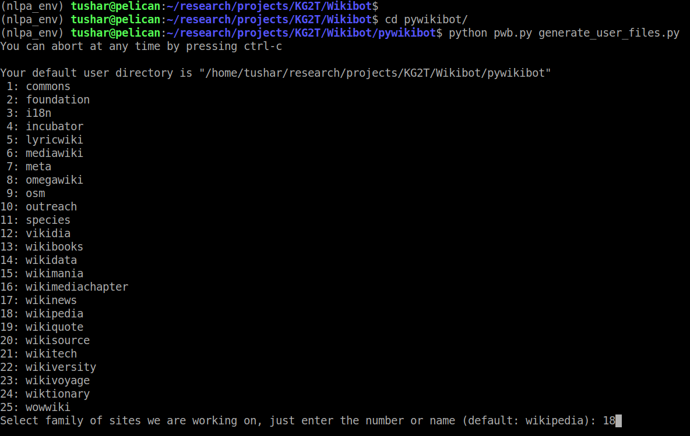
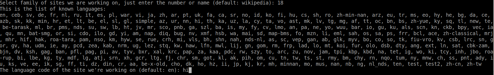
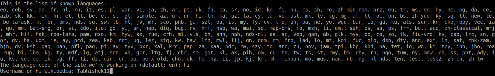
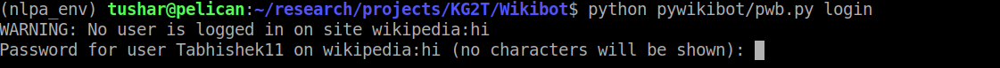
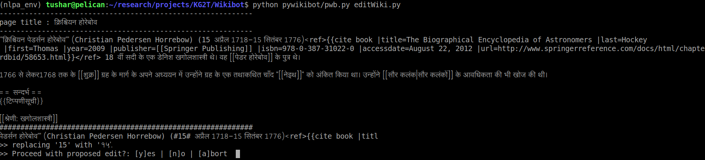

# Wikibot
A simple python bot to edit wikipedia pages in semi-supervised fashion.

## Setup

Install the required modules (Python version 3.5 >=) using the following command:

```
pip install -r requirement.txt
```

Also its important to clone the pywikibot repository in current directory as it will be required for configuring the bot and using modules of pywikibot to edit the pages. More information regarding this can be found [here](https://www.mediawiki.org/wiki/Manual:Pywikibot/Installation) 

```
git clone https://github.com/wikimedia/pywikibot.git
``` 

## Configuration
Before editing the articles we have to login to wikipedia using pywikibot interface. Pywikibot supports many wikipedia project sites, where user can contribute their work. To configure this we have to type in the following command:

```
cd pywikibot
python pwb.py generate_user_files.py
``` 

Once the configuration process starts, it will ask us to choose a desired project from a list of wikipedia projects that pywikibot support. For our work we have to select the `wikipedia project` by typing in the number adjacent to the wikipedia project:



Now this will request us to choose the language in which we want to carry out our work. We will choose `hindi` language for the current work which will abbreviated as `hi`:



If everything went well, it will ask for the username with which, the user can login to wikipedia.



After that it will ask whether to add any other project, and we will select `No` and move forward. At last it will ask us to add Bot-password for mentioned account and we will select `No`. This will generate a new file named `user-config.py` which contains all the above information under the directory `/path_to_project/Wikibot/pywikibot`.

To login to above selected account, type in the following command.

```
python pwb.py login
```

Note: `pwb.py` python file will be present under the same directory `/path_to_project/Wikibot/pywikibot`.



This marks that we have successfully configured the bot and can shift to editing the wikipedia articles.

## Editing the hindi wikipeda articles

At present this bot only changes english numerical literals (present in quite a few hindi wikipedia articles) into hindi numerical literals, for example `2020` will be changed to `२०२०`. This bot can be extended to edit wikipedia in other languages using the similar idea. The bot's configurations are stored in file named : `editWiki.py`.

```
config = {
        'article_count': 20, #total number of articles to be edited
        'max_edits_per_article': -1,  #set -1 for infinite proposed edits per page
        'number_mapping': {  #language specific change
            "0": "०",
            "1": "१",
            "2": "२",
            "3": "३",
            "4": "४",
            "5": "५",
            "6": "६",
            "7": "७",
            "8": "८",
            "9": "९"
        },
        #don't edit exclude_regex
        'exclude_regex': {
            "html_tags": "<\w+[\s|\w]*>(?>[^<>]+|(?R))*</\w+>",
            "reference_tags": "<ref .*>.*?</ref>",
            "wiki_links": "\[\[(?>[^\[\]]+|(?R))*\]\]",
            "curly_braces": "{{(?>[^{}]+|(?R))*}}",
            "url": "http[s]?://(?:[a-zA-Z]|[0-9]|[$-_@.&+]|[!*\(\), ]|(?:%[0-9a-fA-F][0-9a-fA-F]))+",
            "www": "www\.(?:[a-zA-Z]|[0-9]|[$-_@.&+]|[!*\(\), ]|(?:%[0-9a-fA-F][0-9a-fA-F]))+",
            "comments" : "<--.*?-->",
            "styles" : "\[\|.*?\|\]",
            "tables" : '{\|.*?\|}',
            "sections" : "\s(=+.*=+)\s",
            "references" : "\[(?>[^\[\]]|(?R))*\]",
        },
        'state_file': None,
        'edit_msg': "अंग्रेजी संख्या मूल्यों को हिंदी संख्या में परिवर्तित करना",
        #if True, it will highlight the edit in wikipage [NOTE:may not work properly on all terminal so turned off by default]
        'highlight_edits': False,
    }
``` 

The above code snippet shows an example configuration of the bot. Details of each variables:
- `article_count` : the bot fetches this many random articles from global wikipedia for editing.
- `max_edit_per_article` : specifies what's the maximum numbers of edit that can be done on one page. If set to `-1` then bot will edit all numerical literal in the article.
- `number mapping` : stores the one-to-one mapping between english numerical literal and hindi numerical literal
- `exclude_regex` : it consists of regular expression for the section of wikipedia that shouldn't be searched for edits, like changes the externnal references, categories, internal link, wikipedia section, comments, tables, styles etc.
- `state_file` : this file is for maintaining a list of already yedited articles so that the Bot doesn't edit them in next independent run. If `None` a default file location will be used
- `edit_msg` : (optional) this will write the specified message while editing a page.
- `highlight_edit` : This will mark the word that will be edited by the bot which can help user to check the changes before editing the article.

For editing change the directory to `/path_to_project/Wikibot/` and type in the following command:

```
python pywikibot/pwb.py editWiki.py
```

The bot will ask for user input:
- `y` for proceeding with the change within current page
- `n` for abadoning the change within current page
- `a` to drop all changes to present page and skip to next one.
